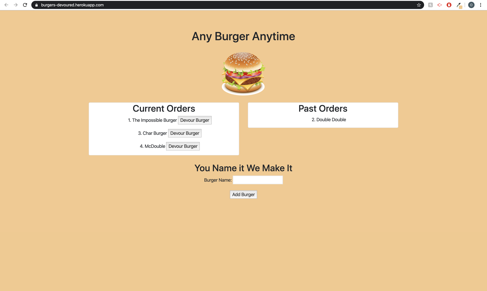

# Burger

## Table of contents
* [Deployed Repo](#deployed-repo)
* [Assignment Info](#assignment-info)
* [Technologies](#technologies)
* [Running Pages](#running-pages)
* [Key Notes](#key-notes)

## Deployed Repo
* HTML
https://burgers-devoured.herokuapp.com/

## Assignment info
Using a MySql database to hold burger information,
within a table. The name of the burger, id and whether
or not it has been devoured yet. User has the option
to create new burgers and add them to a list. That list
consists of a button with a function to eat the burger and
send it to a devoured state. Running different orms functions
for our 'CRUD', to create, post, update or delete info.
	
## Technologies
Project is created with:
* Bootstrap v4.4
* Visual Studios Code (HTML/CSS/JS/JQ)
* Google/W3
* Node.js
* Express
* NPM
* MYSQL
	
## Running Pages
* Here's a screen shot of the running page from an images folder:

 

## Key Notes
* Bootstrap link for html format

```
<link rel="stylesheet" href="https://maxcdn.bootstrapcdn.com/bootstrap/4.4.1/css/bootstrap.min.css">
```

*  NPM
- install
- express
- express-handlebars